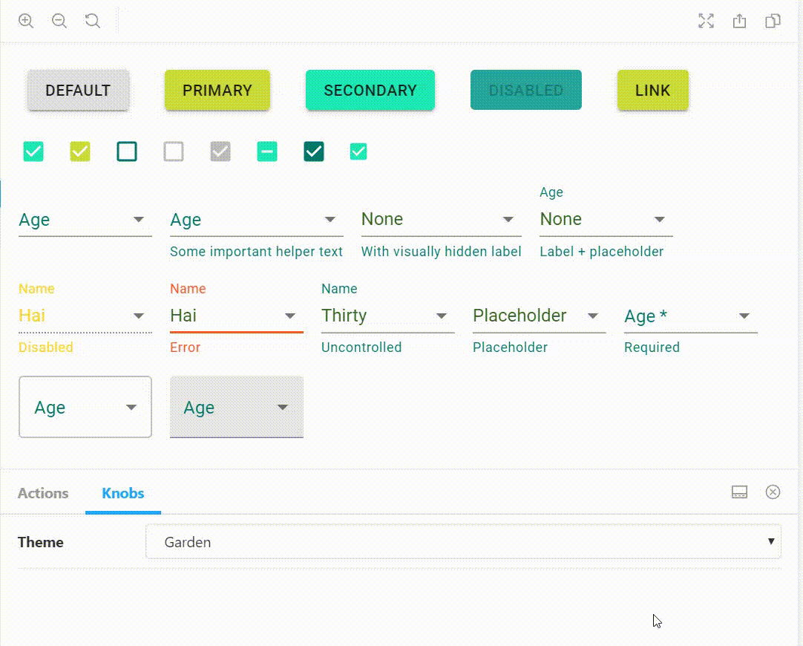

## Easily switch material-ui themes in storybook
You can read more here: https://medium.com/@aleksander_37591/easily-switch-material-ui-themes-in-your-storybook-474638bfc3f1


Using @storybook/addon-knobs

```
npm i
npm run storybook
```




This project was bootstrapped with [Create React App](https://github.com/facebook/create-react-app).
